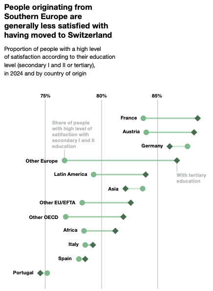
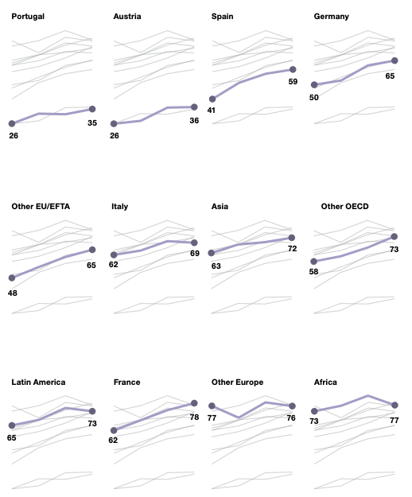
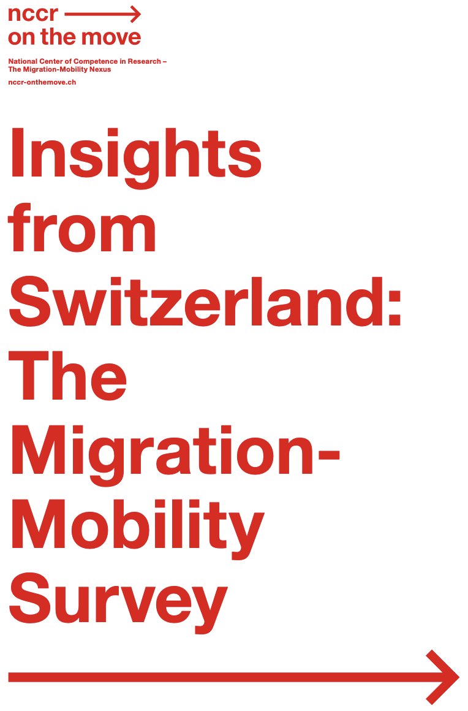

<!--  -->

# NCCR Migration-Mobility Survey: Graphics & Data Visualizations in R 

This repository contains the R code used to generate the data visualizations featured in the book **[Insights from Switzerland: The Migration-Mobility Survey](https://nccr-onthemove.ch/publications/insights-from-switzerland-the-migration-mobility-survey/)**.

👉🏼 📖 **[Read / Download the Full Book (PDF)](https://www.unine.ch/sfm/wp-content/uploads/sites/100/MMS-Book-A4-Final.pdf)**

### 📌 Overview

This repository provides open-access R scripts to ensure full reproducibility of the graphics published in the digital book from the raw survey data.

If you are interested in producing similar charts with your own data or adapting these figures for your research, feel free to explore, reuse, and modify the code! The scripts in this repository represent the original code pipeline used during the book's production. I am aware this is not the most optimised and clean code, use it at our own risk!

The R markdown code is in the [**_Scripts_**](https://github.com/d-qn/NCCR_MMS/tree/main/Scripts) folder, different files (A\_, B\_, ...) for the different chapters.

The raw R charts as svg file can be found in the [**_Output/charts_**](https://github.com/d-qn/NCCR_MMS/tree/main/Output/charts) folder

### 📊 About the Migration-Mobility Survey

The Migration-Mobility Survey (MMS) is conducted by the [NCCR – on the Move](https://nccr-onthemove.ch/)

Longitudinal Scope: **Spanning five survey waves between 2016 and 2024, the MMS is the largest longitudinal survey dedicated to migration and population mobility in Switzerland.**

Comprehensive Trajectories: The survey tracks individual migratory journeys over time, linking them directly to labor market participation, family life, social integration, mobility, citizenship, and cross-border ties.

Beyond Academia: Far more than a statistical data collection, the MMS forms part of a broader effort to deepen scientific knowledge of migration dynamics and make those insights actionable for policy discussions and society at large.